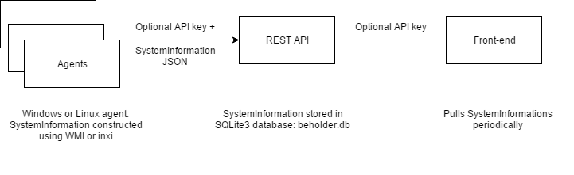
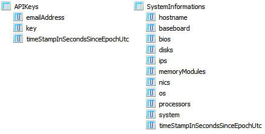

# sizingservers.beholder.api
    2017 Sizing Servers Lab  
    University College of West-Flanders, Department GKG

This project is part of a computer hardware inventorization solution, together with sizingservers.beholder.agent and sizingservers.beholder.frontend.

Agents are installed on the computers you want to inventorize. These communicate with the REST API which stores hardware info. The front-end app visualizes that info.

## Languages, libraries, tools and technologies used
The API is a **C# ASP.NET Core Web Application** (**dotnet core 1.1**: target framework netcoreapp1.1) contained within a **Visual Studio 2017**
solution.  
Furthermore, the **Entity framework** is used to store system information agents send in a **SQLite3** database: beholder.db.

## Overview of the API
Check the XML documentation in the Build / comments in the code. The ApiController class handles all communication.

## Build
You need the SDK (<https://www.microsoft.com/net/download/core#/sdk>) to build the source.

You need to be connected to the Internet for restoring NuGet packages.

Execute *build DEBUG.cmd* or *build RELEASE.cmd*:

    rmdir /S /Q Build\Debug
    cd sizingservers.beholder.api
    dotnet restore
    dotnet publish -c Debug
    dotnet ef --framework netcoreapp1.1 --configuration Debug database update
    cd ..
    copy /Y Build\Debug\netcoreapp1.1\* Build\Debug
    copy /Y Build\Debug\netcoreapp1.1\publish\* Build\Debug
    rmdir /S /Q Build\Debug\netcoreapp1.1\
    
If you do a Release build you can specify if an API key is required for communication from agents to the API. For a Debug build, communication always works without a key.

## Configure

### appsettings.json
    {
      "Logging": {
        "IncludeScopes": false,
        "LogLevel": {
          "Default": "Warning"
        }
      },
      "Authorization" :  false
    }
    
Set Authorization to enable or disable the requirement of an API key for communication from agents to the API.

Only for a Release build, this setting is used. For a Debug build, communication always works without a key.

P.S.: This security measure is a bit silly and should be replaced by something better if you need it. If not, leave it as is.

### beholder.db
beholder.db contains two usable tables:

In APIKeys you can add keys manually, using SQLiteStudio. A key can be anything, for instance a SHA-512.  
SystemInformations is populated automatically by the use of the API. The timestamp is set when SystemInformation is added to / updated in the database.

### hosting.json
    {
      "server.urls": "http://0.0.0.0:5000;http://::1:5000"
    }

Here you can define the used endpoints when running standalone: a ASP.Net Core Web App is just a console application containing a http server (Kestrel). If you want https, host it on a web server like IIS, Nginx, Apache.

## Run
You need the .NET core runtime (<https://www.microsoft.com/net/download/core#/runtime>) to run the build: 1.1.2 at the time of writing.

You need the .NET framework on Windows, but you have that by default.

Execute run.cmd or run.sh or host it on a web server: <https://docs.microsoft.com/en-us/aspnet/core/publishing/>

Alternatively you can run it as a service / daemon. Use NSSM for Windows or the start-as-daemon script for Linux.

To check if it works you can use Postman for instance.